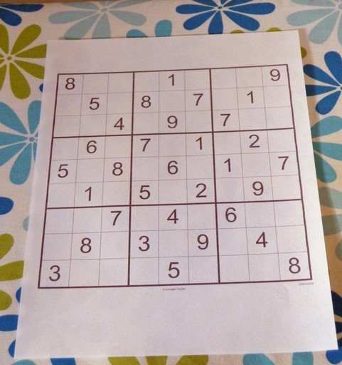

# COMP4102-Project

## Title
Sudoku solver

Abhi Santhosh 
Brandon Hartford 
Eliza Moore
## Summary
In this project, our application will take an image of an unsolved sudoku puzzle, and return an image with the correct numbers filled in to any blank box to solve the puzzle. Our project will include a feature that will colour the numbers and grid so that it easier to tell what was modified.
## Background
A sudoku solver has been done before with OpenCV, and most are achieved by detecting the grid, extracting the grid and detecting the digits within the grid, then solving it.1,2 Our project will also be a sudoku solver, but it will colour the grid and the numbers to help differentiate the numbers that were already there from the ones were added as part of the solution. The sudoku solvers that we have seen online use an older version of OpenCV, whereas we will be using a newer version of the computer vision library; this will change the project implementation and use of OpenCV. Most examples of this project did not include a training set for recognizing digits or hand-written digits - this will be something that we will have to figure out. 
## The Challenge
The challenge of creating the sudoku solver is that there are many steps that need to be considered and implemented. The photo must first be filtered and translated to to better detect edges and correct the image if it is skewed. The digits then have to be detected and read using neural networks. Once the data is extracted and organized,  the puzzle can be solved. The output image will be edited to make the sudoku grid more colourful so that it is easier to read, and existing numbers will be coloured differently than the ones that will be added to the image.
## Goals and Deliverables
The project has four natural sections that can be separated out as deliverables: Image capture and preparation, image analysis, determine puzzle solution, and create the final output image. 

The image capture and preparation stage includes capturing the image from the webcam or loaded from disk, then applying appropriate filters and transformations to the image so it can be analyzed in the next stage (Blurring and/or thresholding for edge detection to detect the sudoku grid). After this stage, the running application will be able to read and image, and output an image with a blurred filter applied.

The image analysis stage includes detecting the puzzle grid, and each individual box, then checking each box. The contents of each box can be recorded, and any existing numbers can be detected and captured for storage. After this stage, the application should be able to output the numbers read from the original image, and output the blurred image as done in the first stage. 

Once all the data from the image has been extracted, the sudoku solving algorithm can be applied to the data to find the solution - and determine which numbers will have to be added to the output image so show the answer. After this stage, the application should be able to also output a text version of the solution - to show that the numbers have been read and the solution has been determined. 

Finally, the output image can be created to include the solution, and functions will be applied to change colour-spaces of the image. The output image will be displayed with the correct numbers displayed over the empty boxes. The added numbers and grid will be colourized to make it easier to tell what was modified.

Another addition to the project, if time permits, is a staged reveal of the answer. If users want to use this application for hints, it might be useful to have multiple output images, each showing a little more of the solution. 

This project seems reasonable for the given time because it is something that has been done before so we have some material to check with and the bonus feature we are adding is reasonable

## Schedule
With 8 weeks until the end of March and 4, possibly 5 deliverables, we plan on finishing a deliverable every 2 weeks. The first week of each deliverable run will be dedicated to planning and dividing up the work, and the second week will be for each of us to finish our respective parts, and review new code. We plan to check in twice a week and help each other whenever needed. 

 Deliverable 1 
Thresholding the sudoku image
 Deliverable 2 
Detecting the sudoku grid is in the picture
 Deliverable 3 
Extract the grid from the picture and transform it so that the grid is the only thing in the photo for the next part
 Deliverable 4 
The digits will be detected and recognized through a neural net that can detect printed numbers and hand written numbers
 Deliverable 5 
The puzzle will be solved and the numbers will be placed onto the image to solve it

# Final Report

## Dependencies
The program requires the header dirent.h. It is included in the C POSIX library so if you are on a Mac or UNIX system you wont need the file. If you are using MSVC, you will need the dirent.h file added to the project.

## Instructions
* Pull code from repository
* If you are on windows, add the dirent.h file as a header in the project. If you are on Mac or Linux you will have to remove the dirent.h file.
* Run the program and it will output the solved image of the sudoku puzzle.
* There are 2 photos which are used for testing, sudoku.jpeg and sudoku2.jpg. The sudoku2.jpg file is currently in the code. To test the other image, change the image being loaded in, in the main method.
## Final Results
This is an image of an unsolved sudoku image

After running the image through the program. The answers to the sudoku puzzle are put back on the image and colorized to make it easier to see

Another sudoku image

## Final Report Doc

COMP 4102

Final Project Report

Sudoku Solver

Abhi Santhosh - 101055288

Brandon Hartford - 100996828

Eliza Moore - 100927429

Carleton University

School of Computer Science

Submitted to: Rosa Azami

April 15, 2020

**Abstract**

The goal of the project is to create a sudoku solver. It can take an image of an unsolved sudoku puzzle, solve it and put the answers back on the image. It also colorizes the image to make it easier to see which numbers have been added. The project has four components. Image capture and preparation, image analysis, determine puzzle solution, and create the final output image. This project is challenging because there are many different tasks required such as warping the image, reading in the numbers and putting the numbers back in the correct spots.

**Introduction**

As mentioned, this project involves 3 major sections: preprocessing, number detection and recognition, and solving the puzzle and preparing the output image. The preprocessing will resize the image to focus in on just the grid using nearest neighbour interpolation, then warp the image to straighten the perspective. The warping process (meant to “unwarp” the grid) involves blurring, thresholding, and edge detection. After the initial pre-processing, further, similar processes can then be applied again to begin to extract the numbers from the grid. This includes more thresholding and finding the contours of the image - which will leave the contents of the individual grid cells. With the use of a training model including multiple images of handwritten numbers 1-9, the program will fit the grid cell data to the data set, and estimate the input digit (note that blank cells are denoted as zeros). Once the data is retrieved, a common back-tracking algorithm can be used on the grid numbers to solve the puzzle. Once the output/solution grid is calculated, the intermediate image obtained after the initial preprocessing can be used to display the new output numbers on the grid in the empty cell locations. 

Sudoku solvers are a good candidate for to be placed into a vision application because not only is it a simple task that will input images that have distinct, consistent features, but similar processing and letter and number recognition can be used for other simple/repetitive tasks. Giving a clear, colour-coded output image with the puzzle solution will also increase the readability and usability of sudoku solver users. This could also be considered a precursor to solving the puzzle as augmented reality.

This is challenging because current sudoku solvers use older versions of the OpenCV library, we’ll have to consult documentation to find updated methods and library functions. Also, to apply the solution back to the image to create a solved output image can be difficult as the grid will have to be sufficiently cropped to focus in the intermediate images to be able to calculate where the solution numbers will be placed on the image to appear as they are part of the grid and within the lines. Creating a training neural network will also be a new challenge, to be able to create the model to predict the digits detected from the grid.  

**Background**	

Sudoku solvers have been done before using OpenCV, and the steps that they have in common are: detecting the grid, extracting the grid, detecting the digits within the grid, and solving the puzzle [2, 3]. The solvers usually output the numbers as text in the console, our puzzle adds the extra step of adding the numbers to the original input image to create the new solved output image. Existing sudoku solver programs are implemented with older versions of OpenCV libraries, but with evolving technology, it is important to use more current library versions. However, these implementations were good references and starting points for our project and helped to outline the steps we should take to implement our own solver. Specifically, choosing which types of preprocessing methods should be considered to best prepare the input puzzle images for a focused output image and easier number extraction from the grid. 

Changing the perspective of the grid so that the sudoku puzzle’s numbers could be read was done with the help of the Hackernoon article [1]. Similar steps were followed to reach the point to where the perspective could be warped such as converting to grayscale, resizing, blurring the image, adaptive thresholding and using the Canny edge detection algorithm. The idea of using a structuring element to remove the gridlines was also taken from the article. The code was written in Go, so the exact values and methods used were not brought from the article.

For this project we will also need to put together a data set to be able to train the neural network and be able to create a model to read/predict the input numbers on the sudoku grid. Sources suggested using one of the MNIST Digit Classification Dataset [5], and the earlier preprocessing steps applied to the original image should allow for easily iterating through a 9x9 cell grid, and each cell can be then be classified using the newly created model. The training can be done easily with the machine learning library provided by OpenCV. 

Although not related to computer vision, another part of this project will include actually solving the sudoku puzzle. This is not new, and backtracking algorithm descriptions and pseudocode can be found readily. The algorithm resembles a “brute-force” attempt to solve the puzzle, trying every valid number in a location until there are no immediate conflicts found in the cell’s row, column, or square. If conflicts are found for every valid number, the algorithm “backtracks” to the last cell that was changed and tries the next potential number solution [4]. 

**Approach**

The approach used to implement this project was to break it down into three deliverables: initial preprocessing and grid detection, number detection, and puzzle solution and output image creation. Implementing them step by step allowed for the project to be worked on my multiple people concurrently.
Preprocessing images are important for multiple computer vision applications, as it prepares the image to be analyzed further and allows for feature detection. In this project, it is used to detect the grid, then straighten and zoom the image to the grid so the individual grid squares can easily be found and used from number recognition. The preprocessing methods used include resizing using nearest neighbour interpolation, blurring, thresholding, and edge detection. Resizing the image is done to ensure consistent image sizes and reduce complexity in the program. The interpolation flag used in this case is nearest neighbour interpolation. This method is used in the case that an image needs to be scaled up, it can be done simple and preserve sharper details, such as grid lines and the grid numbers. Blurring was then done to reduce any image noise (both existing and any introduced during resize), before the thresholding to sow the dark and light features of the image. In this case, we used adaptive thresholding because calculating the threshold value based on smaller regions can account for lighting changes across the image and therefore requires less precision in the input image. Once the image has been blurred, and a thresholding filter has been applied, we use a combination of canny edge detection and the “find contours” method in OpenCV. The largest contour found should be the grid. This will detect the outer limits/edges of the grid, and allow for it to be warped into full perspective of only the grid by using the corners of the largest contour found. To reduce the points of the largest contour, the convex hull algorithm was used. To find the corners of the contour, the point with the smallest X and Y value and the point with the largest X and Y value were found. This gives the top left point in the sudoku grid and the bottom right point of the sudoku grid. The final 2 corners of the grid can be calculated by finding the largest points from the first two points found. With the four corners the warp perspective function can be used in OpenCV. The image then can be again resized to create a standard grid size for the program to work with.

To implement the number recognition, a convolution neural network was created from training a dataset containing images of handwritten numbers with OpenCV’s machine learning functions, specifically the “K-Nearest Neighbour” model. With the trained model, the image of the sudoku grid, processed to be tight to the outer box/contours, could be processed into images of the individual cells. The individual cells would contain the input numbers or a blank space. Blank cells would be read in as zeros due to the dataset used. The individual cell images were processed further to “crop” the image tight to the specific contours of that cell, and resized to have more precise images best resemble the original training data able to best predict the digit accurately. The digits predicted were then stored in a 2-dimensional vector to be able to be used in the next step of solving the puzzle.

The approach to solve the puzzle follows a “back-tracking” algorithm which is commonly used to solve sudoku puzzles. Working with the numbers read from the steps before that were stored in a 2-d vector, any grid number that is a zero (denoting an empty grid cell), will be changed to a valid number (1-9). Each change will include checking for a conflict in the current row, column, or squares, and backtracking to try alternative solutions if needed. After the solution is found, the grid will be output to the console, but it will also be used along with the intermediate warped image to create the program’s output image. Knowing that the warped image is cropped and focused to be tight to the outer grid lines, spacing for the output numbers can be calculated by allowing even spacing for each grid cell height and width. Only numbers that apply to cells that were read as “empty” will be written on top of the warped grid image (as simple text). Grid lines are also added here to make it more readable to the user. 

**List of Work**

Equal work was performed by all project members.
GitHub Page
https://github.com/BHartford/COMP4102-Project

**References**

[1] Andersen, J. “Sudoku Solver with OpenCV 3.2 and Go.” Hackernoon, June 13, 2017. https://hackernoon.com/sudoku-solver-w-golang-opencv-3-2-3972ed3baae2.

[2] Jhawar, Aakash. “Sudoku Solver Using OpenCV and DL - Part 1.” Medium, Medium, 15 Nov. 2019, medium.com/@aakashjhawar/sudoku-solver-using-opencv-and-dl-part-1-490f08701179.

[3] Jhawar, Aakash. “Sudoku Solver Using OpenCV and DL - Part 2.” Medium, Medium, 15 Nov. 2019, medium.com/@aakashjhawar/sudoku-solver-using-opencv-and-dl-part-2-bbe0e6ac87c5

[4] “Sudoku: Backtracking-7.” GeeksforGeeks, 10 May 2019, www.geeksforgeeks.org/sudoku-backtracking-7/.

[5] Syed, Azhar Talha, and Suresh Merugu. “Augmented Reality on Sudoku Puzzle Using Computer Vision and Deep Learning.” International Journal of Innovative Technology and Exploring Engineering Special Issue, vol. 8, no. 11S2, 2019, pp. 140–145., doi:10.35940/ijitee.k1022.09811s219.

